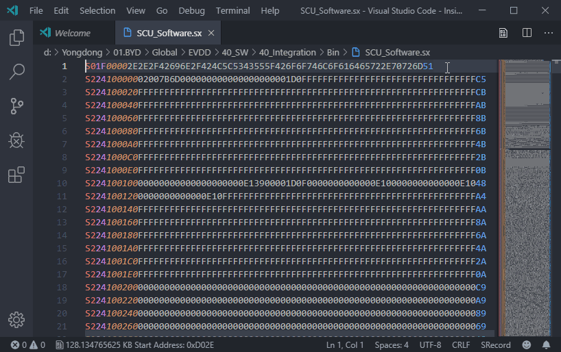
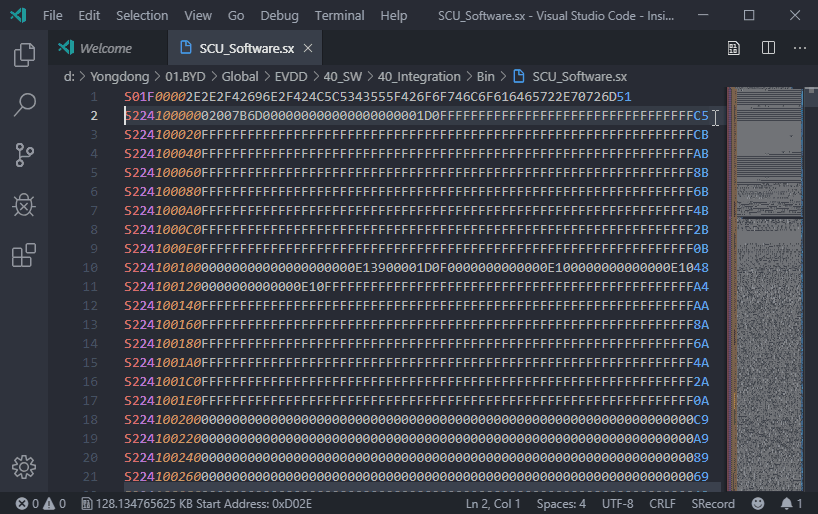

# Motorola S-record for Visual Studio Code

This extension provides support for the [Motorola S-record file format](https://en.wikipedia.org/wiki/SREC_(file_format)).

This extension is based upon keroc's Intel HEX format extension(https://github.com/keroc/hex-fmt)

## Features

### Color syntax

### Status bar indicators

Adds some information on the status bar:
* Binary size in bytes ie the total number of bytes in the binary information contained in the file without all the S-record format overhead.
* Address of the cursor location in the binary information. This will only appear if the record type is data and if the cursor is on the data field.
* The starting execution location.

### File Reparation

Broken srec files can be repaired either automatically on save or by explecitly calling a command.

The reperation process is done record by record and is based on each record header (from startcode to record type).
This means that at least the header must be correct to repair a record. Then the data will be fitted to the byte count and the checksum will be updated.

## Commands

* `Find`: Find the position of a given address in the file.
* `Repair`: Repair the opened srec file.

## Extension Settings

This extension contributes the following settings:

* `srecord.repairOnSave`: tells if a srec file must be repaired when saved (default to false).

## Release Notes

See [CHANGELOG.md](CHANGELOG.md).